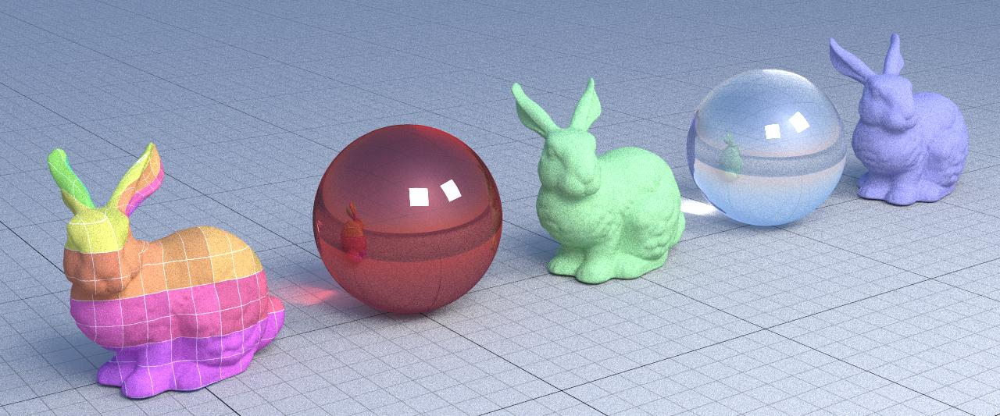
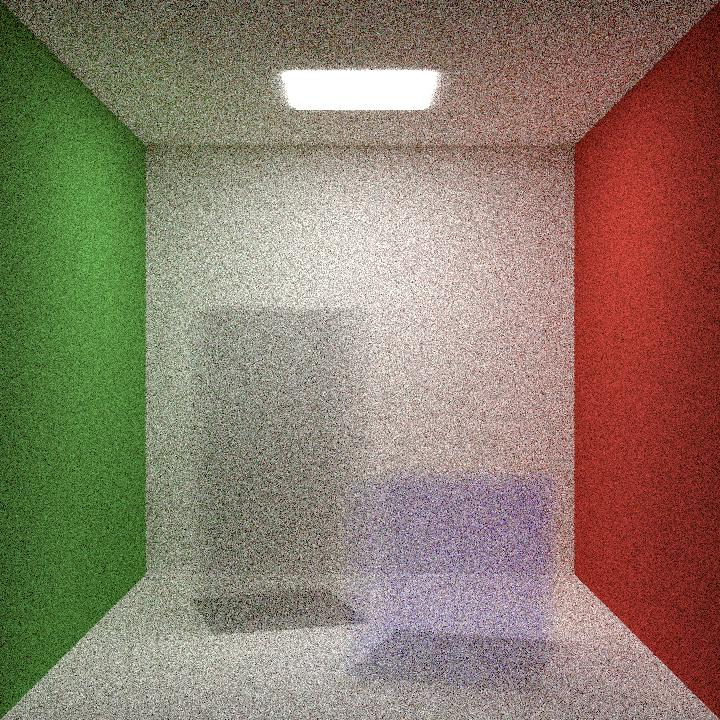
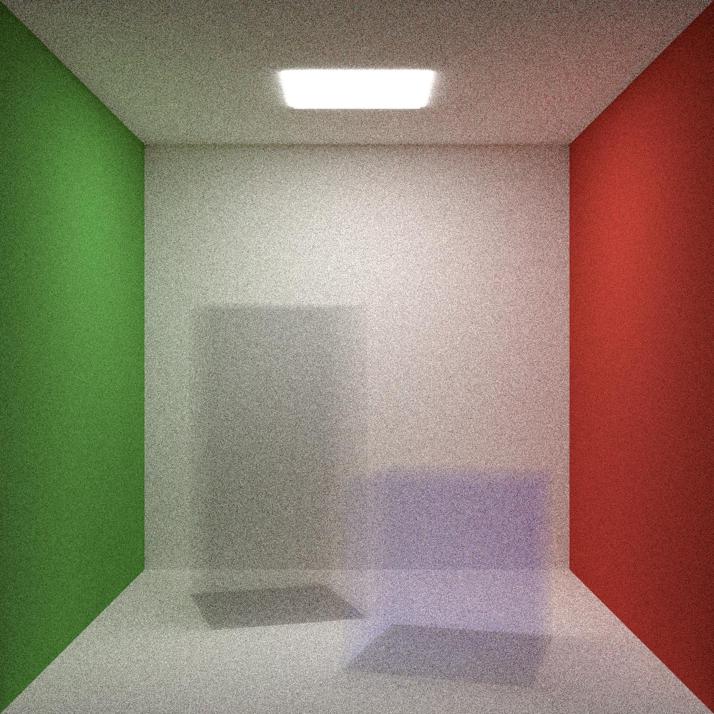
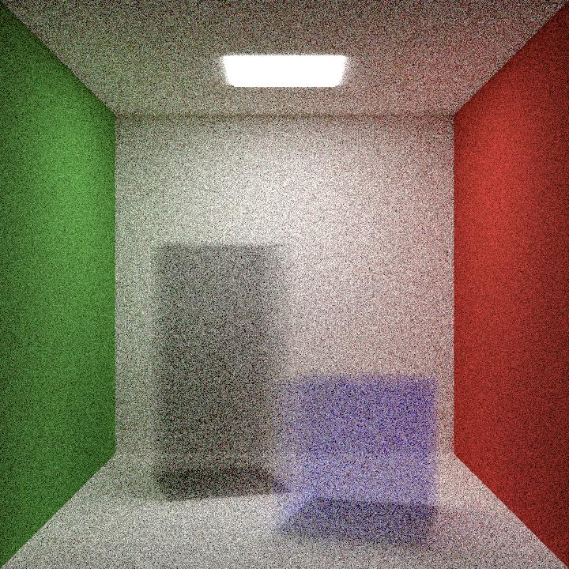
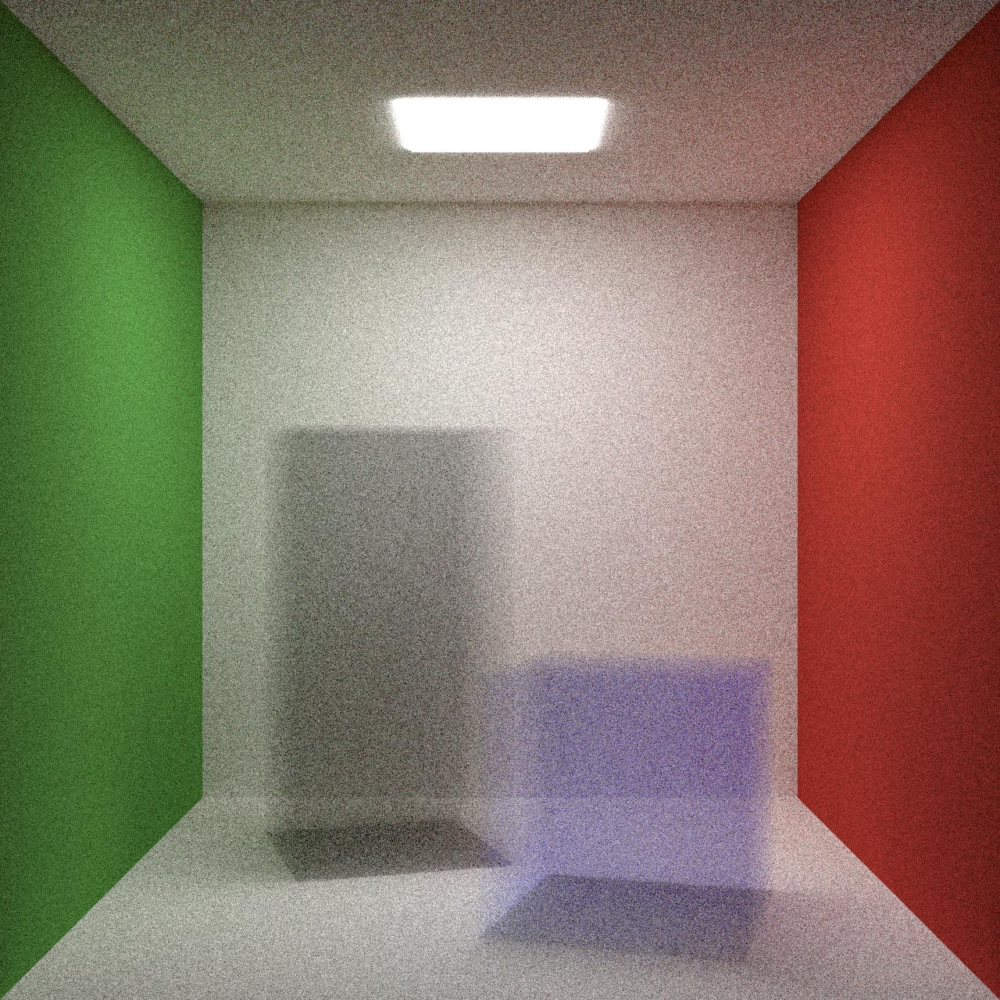

# Computer Graphics: HW2

Implementazione di path tracer per sintesi di immagini utilizzando la libreria [**Yocto/GL**](https://github.com/xelatihy/yocto-gl).

# Funzionalità Richieste

-   **Color Shader**

-   **Normal Shader**

-   **Texcoord Shader**

-   **Eyelight Shader**

-   **Raytrace Shader**

# Funzionalità Extra

## **Refraction**

**Difficoltà:** Facile

Simula la rifrazione sugli oggetti su cui è applicato il materiale "refractive".

---

## **Volume rendering**

**Difficoltà:** Difficile

Rendering volumetrico sugli oggetti su cui è applicato il materiale "volumetric".

-   Quando interseco oggetto volumetrico
-   Dal punto di intersezione lancio un nuovo raggio nella stessa direzione e testo l'intersezione con l'oggetto stesso
    -   Se lo colpisco, significa che ero fuori l'oggetto ed ho raggiunto l'altro estremo. Lo spazio da attraversare quindi è tra questi due punti.
    -   Altrimenti significa che ero all'interno dell'oggetto. Lo spazio da attraversare è quindi la distanza percorsa dal raggio stesso.
-   Calcolo dunque lo spazio che attraverso nell'oggetto
-   Calcolo la probabilità di scattering
-   Testo tale probabilità ed eventualmente faccio scattering
    -   Se ciò accade, prendo un punto interno da cui far partire il nuovo raggio e lo lancio in una direzione casuale
    -   Altrimenti faccio uscire il raggio dall'oggetto e lo tratto come se fosse "invisibile"

> **Volume density 0.5** (samples: 256, bounces: 8, resolution: 720)

> **Volume density 0.5** (samples: 1024, bounces: 64, resolution: 1280)

> **Volume density 0.99** (samples: 256, bounces: 8, resolution: 720)

> **Volume density 0.99** (samples: 1024, bounces: 64, resolution: 1280)

Source: https://raytracing.github.io/books/RayTracingTheNextWeek.html#volumes
